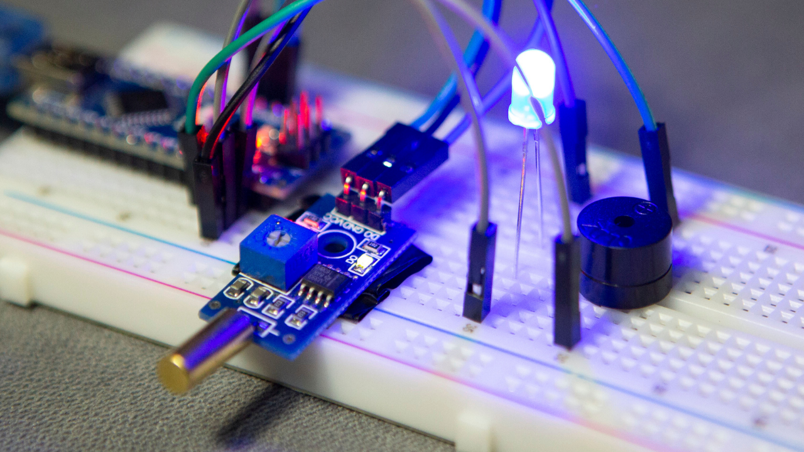
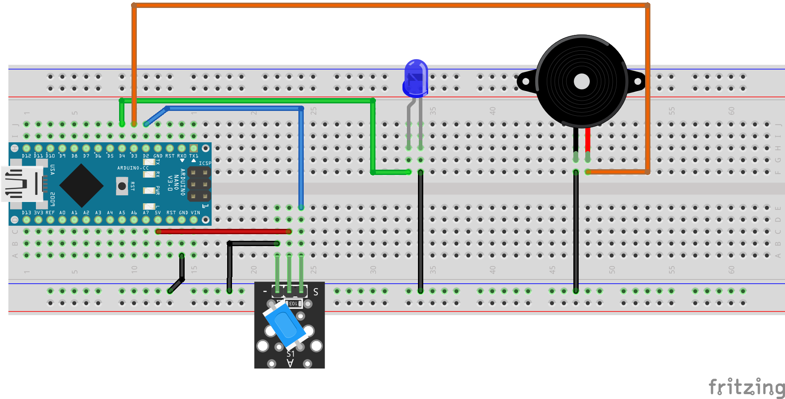

# How to use TILT sensor with LED BUZZER and ARDUINO
The tilt sensor is a component that can detect the tilting of an object. However it is only the equivalent to a pushbutton activated through a different physical mechanism. This type of sensor is the environmental-friendly version of a mercury-switch. It contains a metallic ball inside that will commute the two pins of the device from on to off and viceversa if the sensor reaches a certain angle.   
    
# Video Tutorial
  
# Schematic
    
# Required Hardware:
**LM393 Tilt Angle Sensor -** https://bit.ly/3m3FgGX  
**Arduino Nano V3 -** http://bit.ly/2RTa3rp  
**LED Kit -** http://bit.ly/37OajhS  
**5V Buzzer -** http://bit.ly/33koZn5  
**Breadboard -** http://bit.ly/30ckFoc  
**Jumper Wires -** http://bit.ly/2MtyZCX  
# Contact Me:
https://www.instagram.com/mertarduino  
